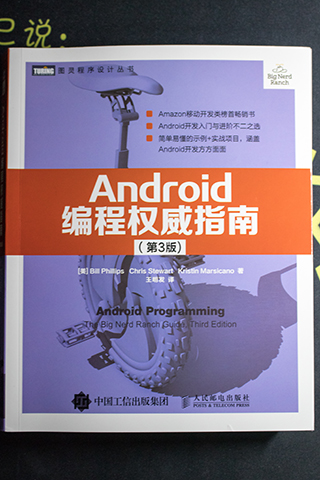

# 《Andorid 编程权威指南（第三版）》（*Android Programming The Big Nerd Ranch Guide, Third Edition*）

## 书评

| 应用图标 | 应用名 | github 地址 |
| :-: | :-: | - |
|  | GeoQuiz | 暂无 |
|  | CriminalIntent | [https://github.com/gdut-yy/CriminalIntent](https://github.com/gdut-yy/CriminalIntent) |
|  | BeatBox | [https://github.com/gdut-yy/BeatBox](https://github.com/gdut-yy/BeatBox) |
|  | NerdLauncher | [https://github.com/gdut-yy/NerdLauncher](https://github.com/gdut-yy/NerdLauncher) |
|  | PhotoGallery | 暂无 |
|  | DragAndDraw | [https://github.com/gdut-yy/DragAndDraw](https://github.com/gdut-yy/DragAndDraw) |
|  | Sunset | [https://github.com/gdut-yy/Sunset](https://github.com/gdut-yy/Sunset) |
|  | Locatr | 暂无 |

## 第 1 章 Android 开发初体验
### GeoQuiz 应用
## 第 2 章 Android 与 MVC 设计模式
## 第 3 章 activity 的生命周期
## 第 4 章 Android 应用的调试
## 第 5 章 第二个 activity
## 第 6 章 Android SDK 版本与兼容

## 第 7 章 UI fragment 与 fragment 管理器
### CriminalIntent 应用

Google有两个版本的fragment实现可供选择：原生版本和支持库版本。

使用支持库fragment的应用，无论在哪台设备上运行，都会有相同的表现。

UUID是Android框架里的Java工具类。有了它，产生唯一ID值就方便多了。

UUID.randomUUID() 产生一个随机唯一ID值。
## 第 8 章 使用 RecyclerView 显示列表

RecycleView、ViewHolder 和 Adapter
## 第 9 章 使用布局与组件创建用户界面

ConstraintLayout

- px：
- dp：
- sp：
- pt、mm、in：
## 第 10 章 使用 fragment argument
## 第 11 章 使用 ViewPager
## 第 12 章 对话框
AlertDialog

## 第 13 章 工具栏
AppCompat
## 第 14 章 SQLite 数据库
## 第 15 章 隐式 intent

Intent对象用来向操作系统说明需要处理的任务。使用显示intent时，我们需指定要操作系统启动哪个activity。

使用隐式intent时，只需告诉操作系统你想要做什么，操作系统就会去启动能够胜任工作任务的activity。如果找到多个符合的activity，用户会看到一个可选应用列表，然后就看用户如何选择了。
## 第 16 章 使用 intent 拍照
## 第 17 章 双版面主从用户界面
主从用户界面（master-detail interface）
## 第 18 章 应用本地化
中文资源
## 第 19 章 Android 辅助功能
TallBack

## 第 20 章 数据绑定与 MVVM
### BeatBox 应用

MVVM架构

数据绑定

assets

## 第 21 章 音频播放与单元测试
## 第 22 章 样式与主题
## 第 23 章 XML drawable
## 第 24 章 深入学习 intent 与任务
### NerdLauncher 应用

## 第 25 章 HTTP 与后台任务
### PhotoGallery 应用

## 第 26 章 Looper、Handler 和 HandlerThread
Message

消息是Message类的一个实例，它有好几个实例变量，其中有三个需要你定义。

- what：用户定义的int型消息代码，用来描述消息。
- obj：用户指定，随消息发送的对象。
- target：处理消息的Handler。 
## 第 27 章 搜索
## 第 28 章 后台服务
## 第 29 章 broadcast intent
## 第 30 章 网页浏览
## 第 31 章 定制视图与触摸事件
## 第 32 章 属性动画
## 第 33 章 地理位置和Play服务
## 第 34 章 使用地图
## 第 35 章 material design