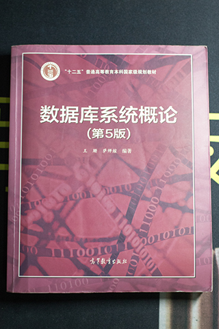

# 《数据库系统概论（第5版）》王珊 萨师煊 编著

## 书评

教授我们这门课的老师是 cshao，一位个人觉得非常棒的老师。

有趣的是这门课程我在没有重修的基础上上了两次，因为选修课程【SQL Server 数据库应用】也是选用这本书。

# 第一篇 基 础 篇 

## 第 1 章 绪论
### 1.1.1 数据库的4个基本概念

**数据、数据库、数据库管理系统和数据库系统**是与数据库技术密切相关的4个基本概念。

- **数据（data）**：描述失误的符号称为数据。
- **数据库（DataBase，DB）**：数据库是长期存储在计算机内、有组织的、可共享的大量数据的集合。数据库中的数据按一定的数据模型组织、描述和存储，具有较小的冗余度（redundancy）、较高的数据独立性（data independency）和易扩展性（scalability），并可为各种用户共享。
- **数据库管理系统（DataBase Management System，DBMS）**：数据库管理系统是计算机的基础软件。
- **数据库系统（DataBase，DBS）**：数据库系统是由数据库、数据库管理系统（及其应用开发工具）、应用程序和数据库管理员（DataBase Administrator，DBA）组成的存储、管理、处理和维护数据的系统。

### 1.2.3 数据模型的组成要素
数据模型通常由**数据结构、数据操作和数据的完整性约束条件**三部分组成。

- **数据结构**描述数据库的组成对象以及对象之间的联系。
- **数据操作**是指对数据库中各种对象（型）的实例（值）允许执行的操作的集合，包括操作及有关的操作规则。
- **数据的完整性约束条件**是一组完整性规则。

### 1.3.2 数据库系统的三级模式结构

- **模式（schema）**：模式也称逻辑模式，是数据库中全体数据的逻辑结构和特征的描述，是所有用户的公共数据视图。**一个数据库只有一个模式**。
- **外模式（external schema）**：外模式也称子模式（subschema）或用户模式，它是数据库用户能够看见和使用的局部数据的逻辑结构和特征的描述，是数据库用户的数据视图，是与某一应用有关的数据的逻辑表示。**一个数据库可以有多个外模式**。
- **内模式（internal schema）**：内模式也称存储模式（storage schema），**一个数据库只有一个内模式**。它是数据物理结构和存储方式的描述，是数据在数据库内部的组织方式。

## 第 2 章 关系数据库

### 2.2.1 基本的关系操作
**选择、投影、并、差、笛卡尔积**是5中基本操作。

### 2.3 关系的完整性

关系模型中有三类完整性约束：**实体完整性、参照完整性和用户定义的完整性**。

## 第 3 章 关系数据库标准语言 SQL

### 3.4.1 单表查询

- 选择表中的若干列
- 选择表中的若干元组
- ORDER BY 子句
- 聚集函数
- GROUD BY 子句
### 3.4.2 连接查询
- 等值与非等值连接查询
- 自身连接
- 外连接
- 多表查询
### 3.4.3 嵌套查询
- 带有 IN 谓词的子查询
- 带有比较运算符的子查询
- 带有 ANY（SOME）或 ALL 谓词的子查询
- 带有 EXISTS 谓词的子查询
### 3.4.4 集合查询
集合操作主要包括**并操作（UNION）、交操作（INTERSECT）和差操作（EXCEPT）**。
### 3.4.5 基于派生表的查询

### 3.4.6 SELECT 语句的一般格式

### 3.6 空值的处理
### 3.7 视图
## 第 4 章 数据库安全性

## 第 5 章 数据库完整性

# 第二篇 设计与应用开发篇

## 第 6 章 关系数据理论

关系数据库中的关系是要满足一定要求的，满足不同程度要求的为不同范式。

## 第 7 章 数据库设计

## 第 8 章 数据库编程

# 第三篇 系 统 篇 

## 第 9 章 关系查询处理和查询优化

## 第 10 章 数据库恢复技术
所谓**事务**是用户定义的一个数据库操作序列，这些操作要么全做，要么全不做，是一个不可分割的工作单位。

事务具有4个特性：**原子性（Atomicity）、一致性（Consistency）、隔离性（Isolation）和持续性（Durability）**。这4个特性简称为 **ACID 特性（ACID properties）**。

- **原子性**：事务是数据库的逻辑工作单位，事务中包括的诸操作要么都做，要么都不做。
- **一致性**：事务执行的结果必须使数据库从一个一致性状态变到另一个一致性状态。
- **隔离性**：一个事务的执行不能被其他事务干扰。即一个事务的内部操作及使用的数据对其他并发事务是隔离的，并发执行的各个事务之间不能互相干扰。
- **持续性**：持续性也称**永久性（Permanence）**，是指一个事务一旦提交，他对数据库中数据的改变就应该是永久性的。接下来的其他操作或故障不应该对其执行结果有任何影响。

## 第 11 章 并发控制 

**事务**是并发控制的基本单位。

并发操作带来的数据不一致性包括**丢失修改、不可重复读和读 “脏” 数据**。

### 1. 丢失修改（lost update）
两个事务 T1 和 T2 读入同一数据并修改，T2 提交的结果破坏了 T1 提交的结果，导致 T1 的修改被丢失。

### 2. 不可重复读（non-repeatable read）
不可重复读是指事务 T1 读取数据后，事务 T2 执行更新操作，使 T1	无法再再现前一次读取结果。具体地讲，不可重复读包括三种情况：

- 1）事务 T1 读取某一数据后，事务 T2 对其进行了修改，当事务 T1 再次读该数据时，得到与前一次不同的值。
- 2）事务 T1 按一定条件从数据库中读取了某些数据记录后，事务 T2 删除了其中部分记录，当 T1 再次按相同条件读取数据时，发现某些记录神秘地消失了。
- 3）事务 T1 按一定条件从数据库中读取了某些数据记录后，事务 T2 插入了一些记录，当 T1 再次按相同条件读取数据时，发现多了一些记录。
- 后两种不可重复读有时也称为**幻影（phantom row）现象**。

### 3. 读 “脏” 数据（dirty read）
读 “脏” 数据是指事务 T1 修改某一数据并将其写回磁盘，事务 T2 读取同一数据后，T1 由于某种原因被撤销，这时被 T1 修改过的数据恢复原值，T2 读到的数据就与数据库中的数据不一致，则 T2 读到的数据就为 “脏” 数据，即不正确的数据。

**并发控制的主要技术有封锁（locking）、时间戳（timestamp）、乐观控制法（optimistic scheduler）和多版本并发控制（multi-version concurrentcy control，MVCC）等。**

## // 第 12 章 数据库管理系统

# // 第四篇 新 技 术 篇

## 第 13 章 数据库技术发展概述

## 第 14 章 大数据管理

## 第 15 章 内存数据库系统

## 第 16 章 数据仓库与联机分析处理技术