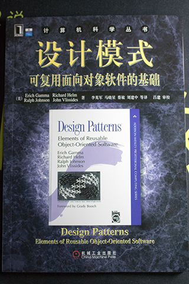

# 《设计模式：可复用面向对象软件的基础》（*Design Patterns Elements of Reusable Object-Oriented Software*）

## 书评
设计模式的经典书籍，又名 *GoF* ！

GoF（Gang of Four），中文名——四人组。

设计模式的经典书籍。

《大话设计模式》作者参考书目，同样是 23 种设计模式。由于本人先读的《大话设计模式》，在一些笔试题中看到 “创建型模式”、“结构型模式” 和 “行为模式” 等常常不知所云。阅读本书后才得知以上概念均出自本书。

PS：本书使用 C++ 语言，《大话设计模式》一书的例子使用 C# 语言。

## 目录

## 第 1 章 引言

## 第 2 章 实例研究：设计一个文档编辑器

## 第 3 章 创建型模式

### 3.1 ABSTRACT FACTORY 抽象工厂

### 3.2 BUILDER 生成器

### 3.3 FACTORY METHOD 工厂方法

### 3.4 PROTOTYPE 原型

### 3.5 SINGLETON 单例

## 第 4 章 结构型模式

### 4.1 ADPTER 适配器
### 4.2 BRIDGE 桥接
### 4.3 COMPOSITE 组成
### 4.4 DECORATOR 装饰
### 4.5 FACADE 外观
### 4.6 FLYWEIGHT 享元
### 4.7 PROXY 代理
### 4.8 结构型模式的讨论

## 第 5 章 行为模式

### 5.1 CHAIN OF RESPONSIBILITY 职责链
### 5.2 COMMAND 命令
### 5.3 INTERPRETER 解释器
### 5.4 ITERPRETER 迭代器
### 5.5 MEDIATOR 中介者
### 5.6 MEMENTO 备忘录
### 5.7 OBSERVER 观察者
### 5.8 STATE 状态
### 5.9 STRATEGY 策略
### 5.10 TEMPLATE METHOD 模板方法
### 5.11 VISITOR 访问者
### 5.12 行为模式的讨论

## 第 6 章 结论