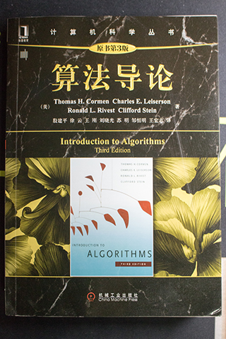

# 《算法导论（原书第3版）》（*Introduction to Algorithms(Third Edition)*）

## 书评

客观来说，算法导论是关于算法与数据结构表述得最为完整的一本书。这本书可以不作为入门书籍，但如果没读过这本书，不能称得上是学习过算法与数据结构。

## 目录

## 第一部分 基础知识
## 第 1 章 算法在计算中的作用
## 第 2 章 算法基础
## 第 3 章 函数的增长
## 第 4 章 分治策略
## 第 5 章 概率分析和随机算法

## 第二部分 排序和顺序统计量
## 第 6 章 堆排序
## 第 7 章 快速排序
## 第 8 章 线性时间排序
## 第 9 章 中位数和顺序统计量

## 第三部分 数据结构
## 第 10 章 基本数据结构
## 第 11 章 散列表
## 第 12 章 二叉搜索树
## 第 13 章 红黑树
## 第 14 章 数据结构的扩张

## 第四部分 高级设计和分析技术
## 第 15 章 动态规划
## 第 16 章 贪心算法
## 第 17 章 摊还分析

## 第五部分 高级数据结构
## 第 18 章 B 树
## 第 19 章 斐波那契堆
## 第 20 章 van Emde Boas 树
## 第 21 章 用于不相交集合的数据结构

## 第六部分 图算法
## 第 22 章 基本的图算法
## 第 23 章 最小生成树
## 第 24 章 单源最短路径
## 第 25 章 所有结点对的最短路径问题
## 第 26 章 最大流

## 第七部分 算法问题选编 
## 第 27 章 多线程算法
## 第 28 章 矩阵运算
## 第 29 章 线性规划
## 第 30 章 多项式与快速傅里叶变换
## 第 31 章 数论算法
## 第 32 章 字符串匹配
## 第 33 章 计算几何学
## 第 34 章 NP 完全性
## 第 35 章 近似算法