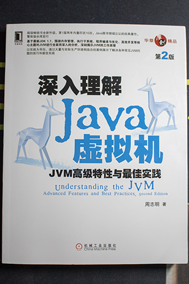

# 《深入理解 Java 虚拟机（第2版）》 周志明 著

## 书评

此书据说是国人所写技术类书籍中挺不错的一本。

从阅后的经验来看，的确如此，它对JVM的讲述非常深刻（在其他Java书籍中可能会一掠而过）。

在面试的时候，当被问到 类加载/委派双亲模型/GC机制 时，总会有点吃力，其中一个原因是属于底层而且容易被忽略。

# 第一部分 走进 Java
## 第 1 章 走进 Java

# 第二部分 自动内存管理机制
## 第 2 章 Java内存区域与内存溢出异常

- **☆程序计数器（Program Counter Register）**：
- **★Java 虚拟机栈（Java Virtual Machine Stacks）**：俗称“栈”区
- **☆本地方法栈（Native Method Stack）**：
- **★Java 堆（Java Heap）**：俗称“堆”区，GC区域，“新生代”、“老年代”
- **☆方法区（Method Area）**：“永久代”
- **运行时常量池（Runtime Constant Pool）**：方法区的一部分
- **直接内存（Direct Memory）**：

## 第 3 章 垃圾收集器与内存分配策略

### 3.5 垃圾收集器

- **Serial 收集器**：最基本、发展历史最悠久的收集器
- **ParNew 收集器**：Serial 收集器的多线程版本
- **Parallel Scavenge 收集器**：新生代收集器
- **Serial Old 收集器**：Serial 收集器的老年代版本
- **Parallel Old 收集器**：Parallel Scavenge 收集器的老年代版本
- **★CMS 收集器**：
- **★G1 收集器**：

### 3.6 内存分配与回收策略

- 对象优先在 Eden 分配
- 大对象直接进入老年代
- 长期存活的对象将进入老年代
- 动态对象判断年龄
- 空间分配担保

## 第 4 章 虚拟机性能监控与故障处理工具

## 第 5 章 调优案例分析与实战

# 第三部分 虚拟机执行子系统

## 第 6 章 类文件结构

## 第 7 章 虚拟机类加载机制

## 第 8 章 虚拟机字节码执行引擎

## 第 9 章 类加载及执行子系统的案例与实战

# 第四部分 程序编译与代码优化

## 第 10 章 早期（编译期）优化

## 第 11 章 晚期（运行期）优化

# 第五部分 高效并发

## 第 12 章 Java 内存模型与线程

## 第 13 章 线程安全与锁优化