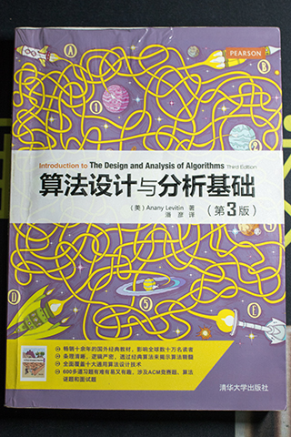

# 算法设计与分析基础（第 3 版）

## 书评

这是校选教材中为数不多的一本国外作者编写的书籍

隐约记得我们的老师是个博士后，他承认自己不会讲课。

每章开头都有一个句子

后来知道，国外的技术类书籍基本如此

## 目录

## 第 1 章 绪论

> 有两种思想，就像摆放在天鹅绒上的宝石那样烨烨生辉，一个是微积分，另一个就是算法。微积分以及微积分基础上建立起来的数学分析体系造就了现代科学，而算法则造就了现代世界。
> 
> ——大卫·柏林斯基

## 第 2 章 算法效率分析基础

> 我常常说，当你对所讲的内容能够进行度量并能够用数字来表达的时候，证明你对这些内容是有所了解的。如果你不能用数字来表达，表明你的认识是不完整的，也是无法令人满意的：无论它是什么内容，他也许正处于知识的初级阶段，但在你的思想中，几乎从没把它上升到一个科学的高度。
> 
> ——开尔文爵士（1824——1907）

> 不是所有能计算的都有价值，不是所有有价值的都能被计算。
>
> ——阿尔伯特·爱因斯坦（1879——1955）

## 第 3 章 蛮力法
> 就像宝剑不是撬棍一样，科学也很少使用蛮力。
> 
> ——爱德华·利顿，《莱拉》，第二卷，第一章

> 把事情做“好”常常是浪费时间。
> 
> ——罗伯特·伯恩

## 第 4 章 减治法

> 普卢塔克说，萨斯特为了教士兵明白毅力和智慧比蛮力更重要的道理，就把两匹马带到他们面前，然后让两个人拔光马尾。一个人是魁梧的大力士，他抓住尾巴拔了又拔，但一点儿效果也没有；另一个人是一个瘦削、长脸的裁缝，他微笑着，每次拔掉一根毛，很快就把尾巴拔得光秃秃的。
> 
> ——科巴姆·布鲁尔

## 第 5 章 分治法

> 一个人无论在祈祷什么，他祈祷的都只不过是一个奇迹，所有祈祷文无非都是一个意思：“伟大的上帝啊，请使二乘二不等于四吧！”
> 
> ——伊万·屠格涅夫

## 第 6 章 变治法

> 生活的秘密在于······用一个烦恼代替另一个烦恼。
> 
> ——查尔斯·M·舒尔茨

## 第 7 章 时空权衡

> 舍卒保车，壮士断腕。
> 
> ——约翰·沃尔夫冈·冯·歌德（1749——1832）

## 第 8 章 动态规划

> 思想，就像幽灵一样······在它自己解释自己之前，必须先告诉它些什么。
> 
> ——查尔斯·狄更斯

## 第 9 章 贪婪技术

> 贪婪，我找不到一个更好的词来描述它，它就是好！它就是对！它就是有效！
> 
> ——美国演员迈克尔·道格拉斯，影片《华尔街》中的台词

## 第 10 章 迭代改进

> 只有将成功建立在稳定增长的基础上，才能成为最终的胜利者。
> 
> ——电话之父，贝尔（1835——1910）

## 第 11 章 算法能力的极限

> 智力用来区分可行性和不可行，理智用来辨别有意义和无意义。所以即使是可行的，也不一定是有意义的。
> 
> ——马克斯·玻恩（1882——1970），My life and My Views，1968

## 第 12 章 超越算法能力的极限

> 不断关注那些已被他人成功应用的新思路，你的原创思想只应该应用在那些你正在研究的问题上。
> 
> ——托马斯·爱迪生（1847——1931）