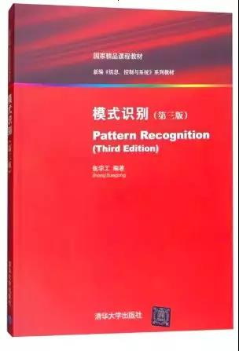

# 《模式识别》 张学工 著

## 书评
《模式识别（第三版）》是清华大学自动化系国家精品课程“模式识别基础”的教材，是在《模式识别》第一版和第二版基础上重写而成的。本教材系统地讨论了模式识别的基本概念和代表性方法，包括监督模式识别中的贝叶斯决策理论、概率密度函数的估计、线性判别函数、非线性判别函数、近邻法、特征选择与提取的典型方法以及非监督模式识别中的基于模型的方法、混合密度估计、动态聚类方法、分级聚类方法等，并在相应章节包括了人工神经网络、支持向量机、决策树与随机森林、罗杰斯特回归、Boosting方法、模糊模式识别等较新进入模式识别领域的内容。整体内容安排力求系统性和实用性，并覆盖部分当前研究前沿。
## 目录