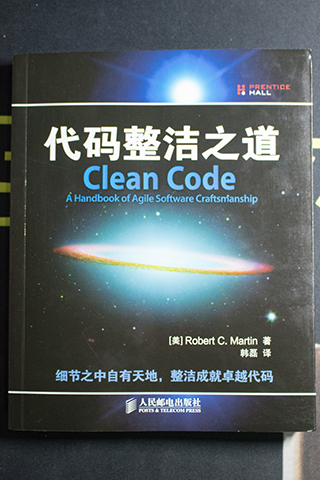

# 《代码整洁之道》（*Clean Code : A Handbook of Agile Software Craftsmanship*）

## 书评
本书的中文版是 2010 的第 1 版。部分章节感觉意义不大，因为很多已经成为常识或者已经有“模板”。

## 目录

## 第 1 章 整洁代码

引经据典地讲述了整洁代码的重要性。

## 第 2 章 有意义的命名
个人感觉本章作用不大。据本人了解，一般大公司都会有统一的命名规范（如：《阿里巴巴Java开发手册》）。

## 第 3 章 函数
- 短小 
- 只做一件事
- 每个函数一个抽象层级
- switch 语句
- 使用描述性的名称

## 第 4 章 注释
个人感觉本章作用不大。不过一些 Javadoc 编写规范还是要去记一下。

## 第 5 章 格式
个人感觉本章作用不大。对于现代的编译器而言，只需要使用快捷键进行 format。

## 第 6 章 对象和数据结构
> 得墨忒耳定律
> 
> 著名的得墨忒耳律（The Law of Demeter）认为，模块不应了解它所操作对象的内部情形。如上节所见，对象隐藏数据，暴露操作。这意味着对象不应通过存取器暴露其内部结构，因为这样更像是暴露而非隐藏其内部结构。
> 
> 更准确地说，得墨忒耳律认为，类 C 的方法 f 只应该调用以下对象的方法：
> 
> - C
> - 由 f 创建的对象；
> - 作为参数传递给 f 的对象；
> - 由 C 的实体变量持有的对象。
> 
> 方法不应调用有任何函数返回的对象的方法。
## 第 7 章 错误处理
- 使用异常而非返回码
- 先写 Try-Catch-Finally 语句
- 使用不可控异常
- 给出异常发生的环境说明
- 依调用者需要定义异常的类
- 定义常规流程
- 别返回 null 值
- 别传递 null 值

## 第 8 章 边界
> 我们很少控制系统中的全部软件。有时我们购买第三方程序包或使用开放源代码，有时我们依靠公司中其他团队打造组件或子系统。不管是哪种情况，我们都得将外来代码干净利落地整合进自己的代码中。

学习 log4j

## 第 9 章 单元测试

> TDD 三定律
> 
> 谁都知道 TDD 要求我们在编写生产代码前先编写单元测试。但这条规则只是冰山之巅。
> 
> 定律一 在编写不能通过的单元测试前，不可编写生产代码。
> 定律二 只可编写刚好无法通过的单元测试，不能编译也算不通过。
> 定律三 止咳编写刚好足以通过当前失败测试的生产代码。

## 第 10 章 类

## 第 11 章 系统
AOP
## 第 12 章 迭进

## 第 13 章 并发编程
> 单一权责原则
> 
> 单一权责原则（SRP）认为，方法/类/组件应当只有一个修改的理由。并发设计自身足够复杂到成为修改的理由，所以也该从其他代码中分离出来。不幸的是，并发实现细节常常直接嵌入到其他生产代码中。下面是要考虑的一些问题：
> 
> - 并发相关代码有自己的开发，修改和调优生命周期；
> - 开发相关代码有自己要对付的挑战，和非并发相关代码不同，而且往往更为困难；
> - 即使没有周边应用程序增加的负担，写得不好的并发代码可能的出错方式数量也已经足举挑战性。
> 
> 建议：分离并发相关代码与其他代码。

## 第 14 章  逐步改进
这里有一段话个人非常喜欢：

> ……这段程序并非从一开始就写成现在的样子。更重要的是，我也没指望你能够一次过写出整洁、漂亮的程序。如果说我们从过去几十年里面学到什么东西的话，那就是编程是一种技艺甚于科学的东西。要编写整洁代码，必须先写肮脏代码，然后再清理它。
> 
> 你应该不会对此感到惊讶。我们在小学就学过这条真理了。那时，老师（通常是徒劳地）努力让我们写作文草稿。他们告诉我们，我们应该先写草稿，再写二稿，一次又一次地草撰，直至写出终稿。他们尽力告诉我们，写出好作文是一个逐步改进的过程。
> 
> ……

## 第 15 章 JUnit 内幕

## 第 16 章 重构 SerialDate
SerialDate 作者 躺枪，

## 第 17 章 味道与启发
> Martin Fowler 在其妙书 *Refactoring : Improving the Design of Existing Code* 中指出了许多不同的“代码味道”。下面的清单半括很多 Martin 提出的味道，还添加了更多我自己提出的，也包括我借以历练本业的其他珍宝与启发。

上述所提到的便是《重构：改善既有代码的设计》一书。

## 附录 A 并发编程 II

## 附录 B org.jfree.date.SerialDate