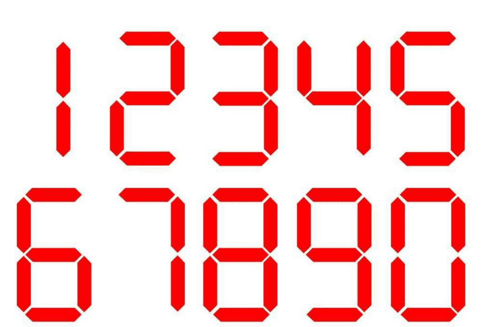

### 用火柴组成数字（如下图） 1需要2根火柴 2需要5根火柴 3需要5根火柴 4需要4根火柴 5需要5根火柴 6需要6根火柴 7需要3根火柴 8需要7根火柴 9需要6根火柴 使用m根火柴 组成n位数 火柴不能浪费 使组成的数数值最大 求这个最大的数值
 

### 编译器版本: Java 1.8.0_66
请使用标准输入输出(System.in, System.out)；已禁用图形、文件、网络、系统相关的操作，如java.lang.Process , javax.swing.JFrame , Runtime.getRuntime；不要自定义包名称，否则会报错，即不要添加package answer之类的语句；您可以写很多个类，但是必须有一个类名为Main，并且为public属性，并且Main为唯一的public class，Main类的里面必须包含一个名字为'main'的静态方法（函数），这个方法是程序的入口
### 时间限制: 3S (C/C++以外的语言为: 5 S)   内存限制: 128M (C/C++以外的语言为: 640 M)
## 输入:
输入数据包括2行 第一行为火柴根数 第二行为需要组成数的位数
## 输出:
组成的最大数
### 输入范例:
	20 7
### 输出范例:
	9771111

----

	import java.io.*;
	import java.util.*;
	import java.text.*;
	import java.math.*;
	import java.util.regex.*;
	
	public class Main {
	
	/** 请完成下面这个函数，实现题目要求的功能 **/
	 /** 当然，你也可以不按照这个模板来作答，完全按照自己的想法来 ^-^  **/
	
	    static String maxNum(int m, int n) {
	
	    }
	
	    public static void main(String[] args){
	        Scanner in = new Scanner(System.in);
	        String res;
	            
	        int _m;
	        _m = Integer.parseInt(in.nextLine().trim());
	        
	        int _n;
	        _n = Integer.parseInt(in.nextLine().trim());
	  
	        res = maxNum(_m, _n);
	        System.out.println(res);
	    }
	}

----
