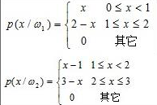

# 网易有道2017内推选择题

## 1
	关于数据解析以下说法正确的是:
	
	正确答案: D   你的答案: D (正确)
	
	A. XML数据结构有且只有一个根节点，并且不能嵌套
	B. JSONObjetWithData:options:error:使用文件流
	C. writeJSONObject:toStream:options:error:使用缓冲区数据解析json
	D. XML解析分为三种:SAX解析、PULL解析和DOM解析

## 2
	大小为MAX的循环队列中，f为当前对头元素位置，r为当前队尾元素位置(最后一个元素的位置)，则任意时刻，队列中的元素个数为
	
	正确答案: D   你的答案: B (错误)
	
	A. r-f
	B. (r-f+MAX+1)%MAX
	C. r-f+1
	D. (r-f+MAX)%MAX

## 3
	已知两个一维模式类别的类概率密度函数为:
	

	先验概率P(ω1)=0.6;P(ω2)=0.4,则样本{x1=1.35,x2=1.45,x3=1.55,x4=1.65}各属于哪一类别?
	
	正确答案: A B C D   你的答案: B (错误)
	
	A. X4 ∈ w2
	B. X3 ∈ w1
	C. X2 ∈ w1
	D. X1 ∈ w1
## 4
	程序员小李通过管道统计prog.c函数中for语句通过的次数，需要使用的指令分别是
	
	正确答案: B C   你的答案: B C (正确)
	
	A. vi
	B. grep
	C. wc
	D. sort
## 5
	请将下列构造函数补充完整，使得程序的运行结果是5
	
		#include<iostream>
		using namespace std;
		class Sample{
		    public:
		        Sample(int x){
		            ________
		        }
		        ~Sample(){
		            if(p) delete p;
		        }
		        int show(){
		            return *p;
		        }
		    private:
		        int*p;
		};
		int main(){
		    Sample S(5);
		    cout<<S.show()<<endl;
		    return 0;
		}
	
	正确答案: B   你的答案: D (错误)
	
	A. *p=x;
	B. p=new int(x);
	C. *p=new int(x);
	D. p=&x;

## 6
	变量z执行结果是（）
	
		int a=5, b=6, c=12;
		int z= (a * b -c ) / a;
	
	正确答案: B   你的答案: B (正确)
	
	A. 6
	B. 3
	C. 4
	D. 5

## 7
	如下Java语句
	
		double x= 3.0; 
		int y=5; 
		x/=--y;
	
	执行后， x的值是（）
	
	正确答案: D   你的答案: D (正确)
	
	A. 3
	B. 0.6
	C. 0.4
	D. 0.75

## 8
	设某棵二叉树的中序遍历序列为BADC，前序遍历序列为ABCD，则后序遍历该二叉树得到序列为（）.
	
	正确答案: B   你的答案: B (正确)
	
	A. BADC
	B. BDCA
	C. BCDA
	D. CBDA
## 9
	关于解释系统的叙述中，正确的是（）
	
	正确答案: A D   你的答案: A D (正确)
	
	A. 解释程序不是直接执行，而是转换成机器可识别码之后才能执行
	B. 使用解释系统时会区分编译阶段和运行阶段
	C. 目标程序可以脱离其语言环境独立执行，使用比较方便、效率较高
	D. 一般来说，建立在编译基础上的系统在执行速度要优于建立在解释执行基础上的系统
## 10
	在一个10阶的B-树上，每个树根结点中所含的关键字数目最多允许为( )个，最少允许为( )个。
	
	正确答案: B   你的答案: A (错误)
	
	A. 10,5
	B. 9,4
	C. 8,3
	D. 7,6
## 11

	下列程序编译时会出现错误，请根据行号选择错误位置( )
	
		#include <iostream>
		using namespace std;
		class A{
		  int a1;
		protected:
		  int a2;
		public:
		  int a3;
		};
		class B: public A{
		  int b1;
		protected:
		  int b2;
		public:
		  int b3;
		};
		class C:private B{
		  int c1;
		protected:
		  int c2;
		public:
		  int c3;
		};
		int main(){
		  B obb;
		  C obc;
		  cout<<obb.a1;//1
		  cout<<obb.a2;//2
		  cout<<obb.a3;//3
		  cout<<obc.b1;//4
		  cout<<obc.b2;//5
		  cout<<obc.b3;//6
		  cout<<obc.c3;//7
		  return 0;
		}
	
	正确答案: A D   你的答案: D (错误)
	
	A. 1,2
	B. 2,5,7
	C. 3,4,7
	D. 4,5,6

## 12
	一磁带机有9道磁道，带长700m，带速2m/s，每个数据块1k字节，块间间隔14mm。如果数据传输率为128000字节/秒,求记录位密度为（）字节/m.
	
	正确答案: B   你的答案: B (正确)
	
	A. 500000
	B. 64000
	C. 1000000
	D. 12800
## 13
	以下几条路由，10.1.193.0/24,10.1.194.0/24,10.1.196.0/24,10.1.198.0/24，如果进行路由汇聚，则能覆盖这几条路由地址的是（）
	
	正确答案: C   你的答案: C (正确)
	
	A. 10.1.192.0/22
	B. 10.1.200.0/22
	C. 10.1.192.0/21
	D. 10.1.224.0/20